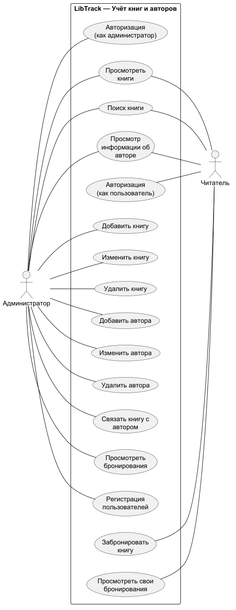

# Учет книг и авторов (литературный клуб)

## Цель работы

Изучить основные этапы создания информационной системы. Научиться описывать её задачи, пользователей и основные функции. Получить навыки создания Use Case диаграмм и блок-схем для наглядного представления работы системы.

## Практическая часть

## 1. Постановка задачи

### 1.1 Описание предметной области

Предметная область — литературный клуб, в котором нужно вести учёт книг и их авторов.  
Для этого создаётся информационная система «LibTrack».  
Пользователь может искать и бронировать книги, а администратор — добавлять, изменять и удалять данные.  
Система предназначена для хранения и обработки информации о книгах, авторах, пользователях и бронированиях.

### 1.2 Цели и задачи системы

- **Хранение информации о книгах:** Хранить сведения о книгах в системе.
- **Хранение информации об авторах:** Хранить сведения об авторах и связывать их с книгами.
- **Поиск книг:** Предоставить читателю возможность выполнять поиск книг.
- **Бронирование книг:** Предоставить читателю возможность создавать бронирования книг.
- **Управление данными**: Предоставить администратору возможность добавлять, изменять и удалять данные.

### 1.3 Пользователи системы (актеры) и их роли

1. **Администратор:** Управляет данными системы. Добавляет, изменяет и удаляет книги и авторов, связывает книги с авторами, просматривает бронирования, регистрирует администраторов и читателей.
2. **Читатель:** Работает с каталогом книг. Просматривает и ищет книги, просматривает свои бронирования, информацию об авторах и создаёт бронирования.

### 1.4 Основной функционал

- **Добавление новой книги** (ввод названия, автора и другой информации о книге).
- **Поиск книги** (поиск нужной книги в каталоге).
- **Просмотр информации о книге и авторе.**
- **Бронирование книги** (оформление бронирования выбранной книги).
- **Изменение и удаление данных** о книгах и авторах.
- **Просмотр своих бронирований**: Читатель может просматривать свои бронирования.
- **Просмотр бронирований**: Администратор может просматривать информацию о бронированиях.
- **Авторизация пользователя** (ввод имени и пароля пользователя).
- **Авторизация администратора** (ввод имени и пароля администратора).
- **Регистрация пользователей** (создание учётных записей администраторов и читателей администратором).

### 1.5 Архитектура проекта

Мы используем **трёхуровневую архитектуру**. Система состоит из трёх основных частей:

1. **Слой интерфейса:** Пользователь работает с системой через интерфейс. Здесь можно искать книги, просматривать информацию и выполнять другие действия.
2. **Слой бизнес-логики:** Отвечает за основные действия системы. Проверяет данные и выполняет операции с книгами, авторами и бронированиями.
3. **Слой данных:** Хранит информацию о книгах, авторах, пользователях и бронированиях.

## 2. Моделирование процессов и взаимодействий

### 2.1 Use Case диаграмма

